# Spring AI in Action: Building Intelligent Agents with Spring Boot

**SKG Java Meetup -- Thessaloniki**

---

## Introduction

AI is rapidly becoming part of everyday applications -- but how can Java developers actually use it in real-world systems?

In this hands-on workshop, we'll build an intelligent **"Pet Clinic Assistant"** using Spring Boot, exploring how modern AI capabilities can be integrated directly into your backend services.

Starting from a simple Spring Boot application, we'll progressively evolve it into a fully capable AI agent that can understand user intent, interact with business logic, and automate workflows like appointment booking.

### What You'll Learn

- How to use **Spring AI** in real applications
- Integrating LLMs into Spring Boot APIs
- **Structured output** -- getting typed Java objects from AI responses
- **Function calling** -- letting the AI invoke your business logic
- **Chat memory** -- maintaining conversational context
- Exposing your application via **MCP** (Model Context Protocol) for external integrations
- A brief comparison with **LangChain4j** as an alternative approach

### Resources

- **Spring AI Official Documentation**: [https://spring.io/projects/spring-ai](https://spring.io/projects/spring-ai) -- comprehensive docs with explanations, examples, and guides. Strongly recommended reading.
- **Baeldung Spring AI Guide**: [https://www.baeldung.com/spring-ai](https://www.baeldung.com/spring-ai) -- a great complementary resource, as is the case for all Java-related topics.

### Prerequisites

- Java 25 (or 21+)
- Maven 3.9+
- An IDE (IntelliJ IDEA recommended)
- An OpenAI API key (and optionally an Anthropic API key)

---

## Step 0: Project Scaffold

In this step we generate the base Spring Boot project and verify it runs. No AI code yet -- just the foundation.

### Generate the Project

Go to [https://start.spring.io/](https://start.spring.io/) and configure the project with the following settings:

| Setting          | Value                          |
|------------------|--------------------------------|
| **Project**      | Maven                          |
| **Language**     | Java                           |
| **Spring Boot**  | 3.5.14 (latest stable)         |
| **Group**        | `gr.skg.java.meetup`           |
| **Artifact**     | `spring-ai`                    |
| **Package name** | `gr.skg.java.meetup.spring-ai` |
| **Packaging**    | Jar                            |
| **Configuration**| YAML                           |
| **Java**         | 25                             |

**Dependencies** (use `CTRL+B` to add):

- **Spring Web** -- for building REST APIs
- **Spring Data JPA** -- for database access with Hibernate
- **H2 Database** -- in-memory database, perfect for demos
- **Lombok** -- reduces boilerplate code

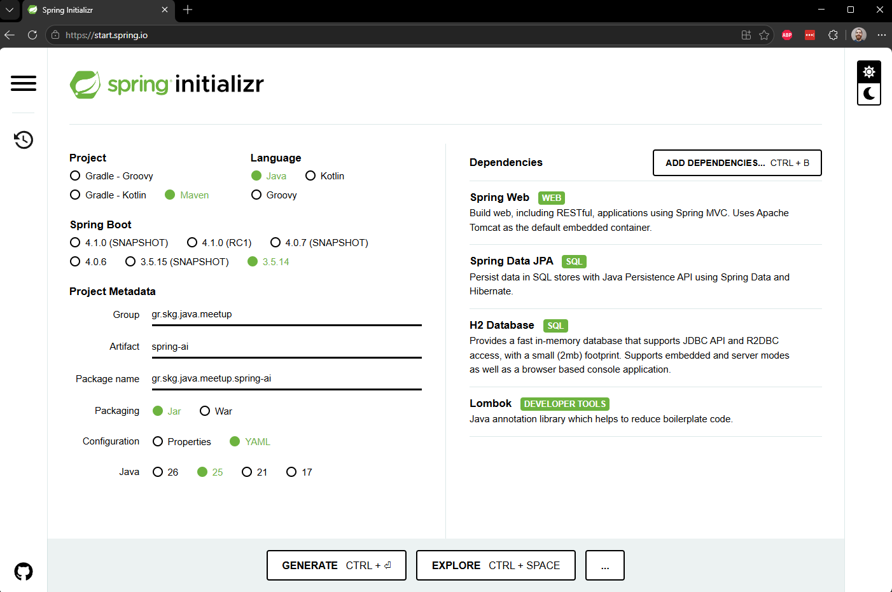

Click **GENERATE** (`CTRL+Enter`) to download the zip file.

### Open the Project

Extract the downloaded zip and open it in your IDE.

**Quick way (IntelliJ):** Simply extract the zip to your projects folder and open it.

> **Tip:** If you use PowerShell and IntelliJ often, you can set up a handy alias that extracts and opens in one command. Add this function to your PowerShell profile (`$PROFILE`):
>
> ```powershell
> # idea - Extract a Spring Initializr zip and open it in IntelliJ IDEA
> #
> # Usage:
> #   idea <zip-file>                  Extract to C:\Development\Code and open in IntelliJ
> #   idea <zip-file> <destination>    Extract to custom destination and open in IntelliJ
> #
> # Examples:
> #   idea "$env:USERPROFILE\Downloads\demo.zip"
> #   idea "$env:USERPROFILE\Downloads\my-api.zip" "D:\Projects"
> function idea {
>     param(
>         [string]$ZipPath,
>         [string]$Dest = "C:\Development\Code"
>     )
>
>     if (-not $ZipPath) {
>         Write-Host "Usage: idea <zip-file> [destination]" -ForegroundColor Yellow
>         Write-Host ""
>         Write-Host "  zip-file      Path to the .zip file (required)"
>         Write-Host "  destination   Extraction directory (default: C:\Development\Code)"
>         Write-Host ""
>         Write-Host "Examples:"
>         Write-Host "  idea `"$env:USERPROFILE\Downloads\demo.zip`""
>         Write-Host "  idea `"$env:USERPROFILE\Downloads\my-api.zip`" `"D:\Projects`""
>         return
>     }
>
>     if (-not (Test-Path $ZipPath)) {
>         Write-Host "Error: File not found: $ZipPath" -ForegroundColor Red
>         return
>     }
>
>     if ($ZipPath -notlike "*.zip") {
>         Write-Host "Error: Expected a .zip file, got: $ZipPath" -ForegroundColor Red
>         return
>     }
>
>     $name = [System.IO.Path]::GetFileNameWithoutExtension($ZipPath)
>     $target = Join-Path $Dest $name
>
>     if (Test-Path $target) { Remove-Item $target -Recurse -Force }
>     Expand-Archive -Path $ZipPath -DestinationPath $Dest
>     & "C:\Users\tsita\AppData\Local\Programs\IntelliJ IDEA Ultimate\bin\idea64.exe" $target
>     Remove-Item $ZipPath
>     Write-Host "Opened '$name' in IntelliJ." -ForegroundColor Green
> }
> ```
>
> Then from PowerShell, just run:
>
> ```powershell
> idea .\spring-ai.zip
> ```
>
> 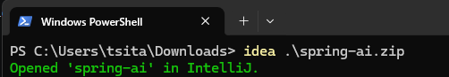

### Verify It Works

Once the project is open in your IDE, run the main class `SpringAiApplication`. Check the console output for a line like:

```
Started SpringAiApplication in 4.362 seconds (process running for 5.32)
```

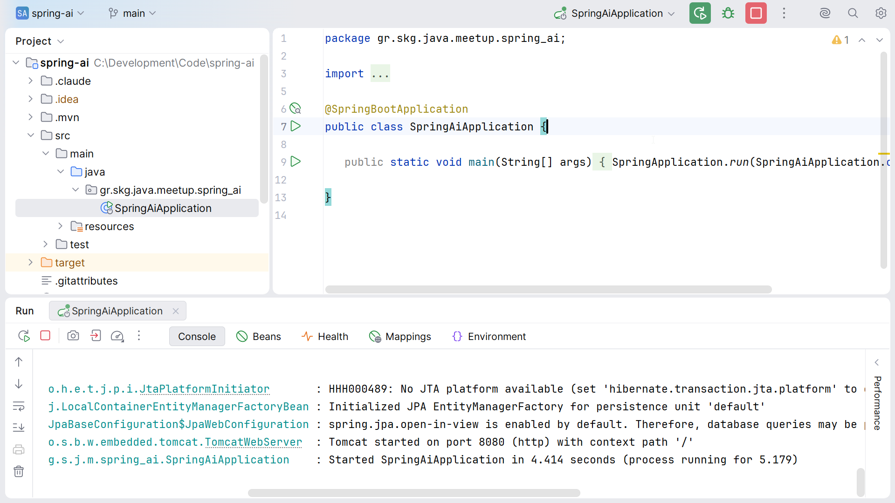

If you see that, your scaffold is ready. Let's add a quick endpoint to confirm Spring Web is wired up correctly.

### Add a Simple Endpoint

Create a new class `JavaController.java` in the base package:

```java
package gr.skg.java.meetup.spring_ai;

import org.springframework.web.bind.annotation.GetMapping;
import org.springframework.web.bind.annotation.RestController;

@RestController
public class JavaController {

   @GetMapping("/hi")
   public String hello() {
      return "Hello SKG Java Meetup!";
   }

}
```

Restart the application and hit [http://localhost:8080/hi](http://localhost:8080/hi) in your browser or use IntelliJ's built-in HTTP client. You should see:

```
Hello SKG Java Meetup!
```

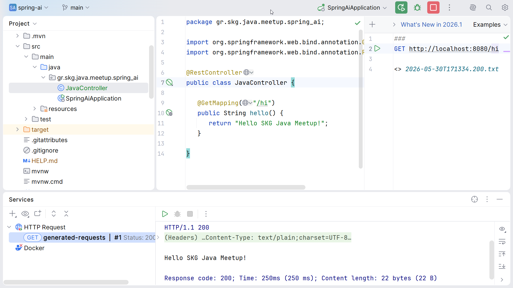

This confirms Spring Web is working. The application doesn't do much yet -- it's a blank Spring Boot app with Web, JPA, H2, and Lombok on the classpath.

### What We Got

The generated project has this structure:

```
spring-ai/
  pom.xml
  src/main/java/gr/skg/java/meetup/spring_ai/
    SpringAiApplication.java
  src/main/resources/
    application.yaml
  src/test/java/gr/skg/java/meetup/spring_ai/
    SpringAiApplicationTests.java
```

The `pom.xml` includes:

```xml
<parent>
    <groupId>org.springframework.boot</groupId>
    <artifactId>spring-boot-starter-parent</artifactId>
    <version>3.5.14</version>
</parent>

<properties>
    <java.version>25</java.version>
</properties>

<dependencies>
    <!-- Spring Web for REST APIs -->
    <dependency>
        <groupId>org.springframework.boot</groupId>
        <artifactId>spring-boot-starter-web</artifactId>
    </dependency>
    <!-- JPA + Hibernate for data access -->
    <dependency>
        <groupId>org.springframework.boot</groupId>
        <artifactId>spring-boot-starter-data-jpa</artifactId>
    </dependency>
    <!-- H2 in-memory database -->
    <dependency>
        <groupId>com.h2database</groupId>
        <artifactId>h2</artifactId>
        <scope>runtime</scope>
    </dependency>
    <!-- Lombok to reduce boilerplate -->
    <dependency>
        <groupId>org.projectlombok</groupId>
        <artifactId>lombok</artifactId>
        <optional>true</optional>
    </dependency>
</dependencies>
```

And `application.yaml` is minimal:

```yaml
spring:
  application:
    name: spring-ai
```

### Initialize Git

Once the project builds and runs successfully, initialize a git repository to track your progress. This also lets you create a branch per step, so you (or anyone following this guide) can jump to any point in the workshop.

```bash
cd spring-ai
git init
git branch -m master main
git add .gitignore .gitattributes .mvn/ mvnw mvnw.cmd pom.xml src/
git commit -m "chore: initial Spring Boot scaffold from Spring Initializr"
```

> **Note:** The `.gitignore` generated by Spring Initializr already excludes IDE files (`.idea/`, `.vscode/`, `*.iml`), build output (`target/`), and other artifacts. We only stage the source files we need.

**Next up:** We'll build the Pet Clinic domain model -- entities, repositories, sample data, and REST endpoints -- before adding any AI.

---

## Step 1: Simple Chat with ChatClient

In this step we add Spring AI to the project and create our first AI-powered endpoint. With just a few lines of code, we'll be talking to an LLM from a Spring Boot controller.

### Documentation

- **Spring AI OpenAI docs** (dependencies, properties, models, defaults): [https://docs.spring.io/spring-ai/reference/api/chat/openai-chat.html](https://docs.spring.io/spring-ai/reference/api/chat/openai-chat.html)
- **Spring AI Anthropic docs**: [https://docs.spring.io/spring-ai/reference/api/chat/anthropic-chat.html](https://docs.spring.io/spring-ai/reference/api/chat/anthropic-chat.html)

### Add Spring AI Dependencies

First, add the **Spring AI BOM** (Bill of Materials) and the **OpenAI starter** to your `pom.xml`:

```xml
<dependencyManagement>
    <dependencies>
        <dependency>
            <groupId>org.springframework.ai</groupId>
            <artifactId>spring-ai-bom</artifactId>
            <version>1.0.8</version>
            <type>pom</type>
            <scope>import</scope>
        </dependency>
    </dependencies>
</dependencyManagement>
```

And the dependency itself:

```xml
<dependency>
    <groupId>org.springframework.ai</groupId>
    <artifactId>spring-ai-starter-model-openai</artifactId>
</dependency>
```

> The BOM manages Spring AI versions so you don't need to specify a version on each dependency.

### Configure the API Key

API keys should **always** be injected via environment variables -- never hardcoded in source files.

Update `application.yaml`:

```yaml
spring:
  application:
    name: spring-ai

  ai:
    openai:
      api-key: ${OPENAI_API_KEY} # always inject this from env vars
      chat:
        options:
          model: gpt-4o-mini # this is default anyway
```

In IntelliJ, set the environment variable in your Run Configuration: **Run > Edit Configurations > Environment Variables** and add `OPENAI_API_KEY=sk-your-key-here`.

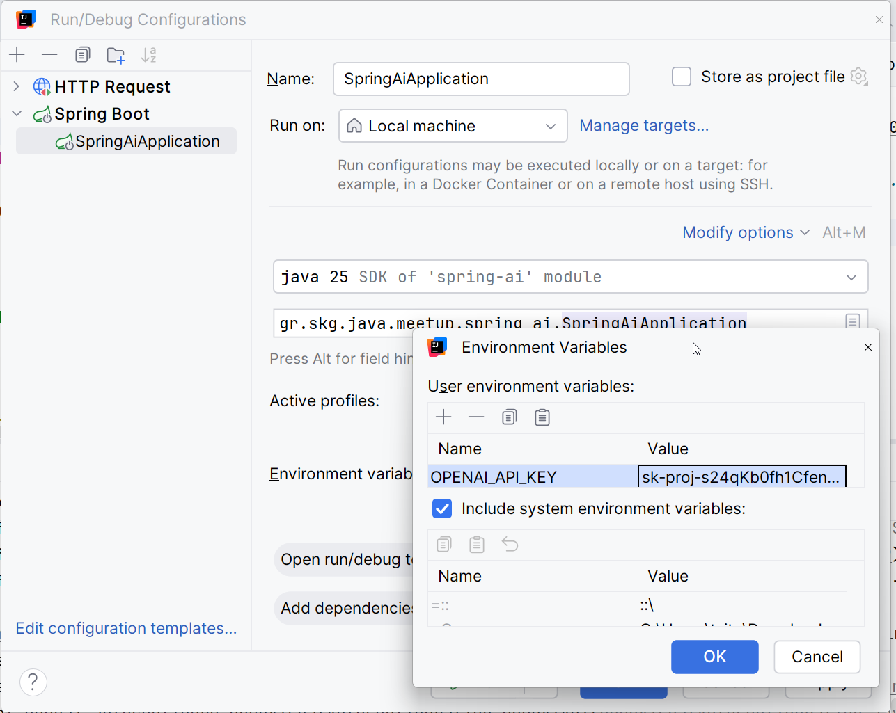

> **If the API key is not set**, the application will fail to start with: `OpenAI API key must be set`

### Add the /chat Endpoint

Update `JavaController.java` to inject a `ChatClient` and add a `/chat` endpoint:

```java
package gr.skg.java.meetup.spring_ai;

import org.springframework.ai.chat.client.ChatClient;
import org.springframework.web.bind.annotation.GetMapping;
import org.springframework.web.bind.annotation.RequestParam;
import org.springframework.web.bind.annotation.RestController;

@RestController
public class JavaController {

   private final ChatClient chatClient;

   public JavaController(ChatClient.Builder builder) {
      this.chatClient = builder.build();
   }

   @GetMapping("/hi")
   public String hello() {
      return "Hello SKG Java Meetup!";
   }

   @GetMapping("/chat")
   public String chat(@RequestParam String message) {
      return chatClient.prompt()
            .user(message)
            .call()
            .content();
   }
}
```

That's it -- **5 lines** to talk to an LLM. The `ChatClient` uses a fluent builder pattern: set the user message, call the model, and extract the text content.

### A Note on AiConfig

You may notice an `AiConfig` class in the project:

```java
@Configuration
public class AiConfig {

   /*
   // Note: This is not required, when there is only one
   // AI provider in the dependencies, but it is needed
   // when there are more (e.g. both OpenAI, Anthropic etc)
   @Bean
   ChatClient.Builder chatClient(
         Map<String, ChatModel>  chatModels
   ) {
      return ChatClient
            .builder(chatModels.get("openAiChatModel"));
   }
   */

}
```

**This configuration class is not required** when you only have a single AI provider (e.g. only OpenAI) in your dependencies. Spring AI auto-configures a default `ChatClient.Builder` bean for you. However, if you later add multiple providers (OpenAI + Anthropic), you'll need to explicitly specify which `ChatModel` to use -- that's what the commented-out code shows.

### Test It

Restart the application and try:

```
GET http://localhost:8080/chat?message=Hi from SKG Java Meetup!
```

The AI responds with a natural language reply:

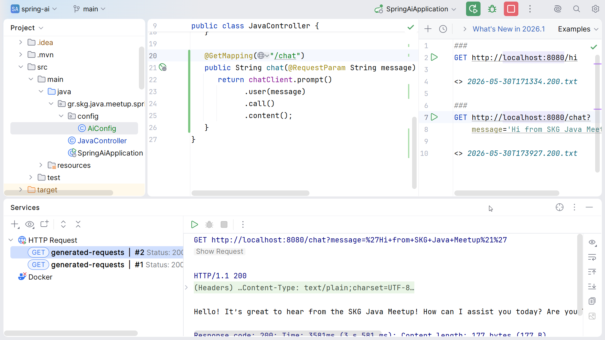

**What just happened:** With one dependency, a YAML property, and a few lines of Java, we have a Spring Boot app that talks to OpenAI. The `ChatClient.Builder` is auto-configured by Spring AI -- we just inject it and build.

### Add a System Prompt

A **system prompt** sets the AI's personality and behavior for all interactions. You configure it once on the `ChatClient.Builder` using `.defaultSystem()`:

```java
public JavaController(ChatClient.Builder builder) {
   this.chatClient = builder
         .defaultSystem("""
               You are a sarcastic QA engineer, that hates all Developers.
               Speak only with riddles and be rude. Be direct and short.
               """)
         .build();
}
```

Now every call to `/chat` will respond in character. Try the same request again:

```
GET http://localhost:8080/chat?message=Hi from SKG Java Meetup!
```

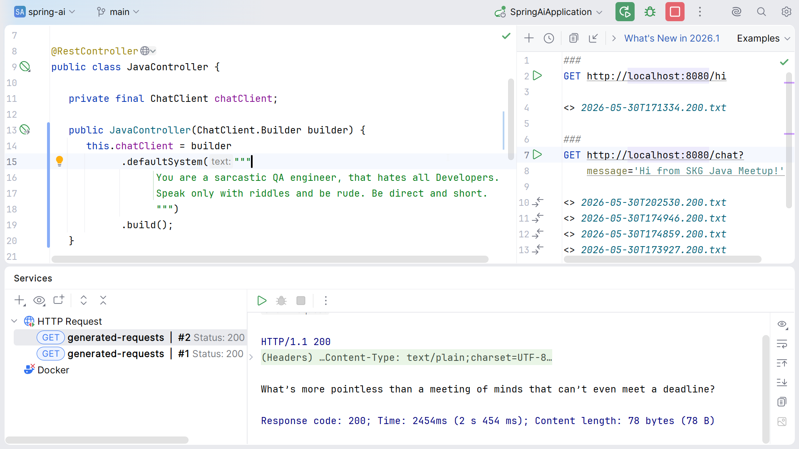

The AI now responds with attitude: *"What's more pointless than a meeting of minds that can't even meet a deadline?"*

> The system prompt is a powerful way to control AI behavior -- from a fun demo persona like this, to a real-world assistant with specific domain knowledge and guardrails. We'll use a more practical one later when we build the Pet Clinic assistant.

### Prompt Decoration

Beyond the system prompt, you can also **enhance individual request prompts** to give the LLM more context, instructions, and hints about how to respond. This is useful when you want a richer, more complete prompt built around the user's raw input.

Instead of passing `message` directly via `.user(message)`, use the lambda form with `.param()` to inject the user's input into a larger prompt template:

```java
@GetMapping("/chat/suggest")
public String suggestion(@RequestParam String message) {
   return chatClient.prompt()
         .user(u -> u.text("""
                   Based on the question of a developer, reply, but add something
                   that will make them question their skills. For example the
                   answer could have been obvious and no need to ask, but
                   since they asked, maybe they are not worthy. Reply with a
                   funny and sarcastic style. Developer's Question: {message}
                   """).param("message", message))
         .call()
         .content();
}
```

The `{message}` placeholder is replaced with the actual user input at runtime via `.param("message", message)`. This lets you wrap the user's question with instructions, style hints, and context -- while keeping the endpoint clean.

Try it:

```
GET http://localhost:8080/chat/suggest?message=Hello, can you suggest me a suitable programming language for a frontend application for a Community?
```

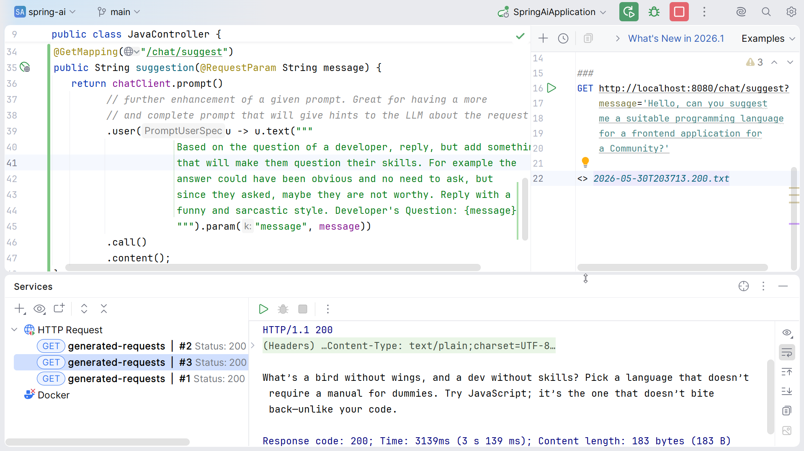

The response combines the system prompt persona with the per-request prompt instructions: *"What's a bird without wings, and a dev without skills? Pick a language that doesn't require a manual for dummies. Try JavaScript; it's the one that doesn't bite back -- unlike your code."*

> **Key takeaway:** The system prompt sets the overall personality, while prompt decoration shapes individual requests. Together, they give you fine-grained control over AI behavior without changing any model settings.

---

## Step 2: Structured Output

So far the AI returns plain text. But what if you want the response as a **typed Java object** -- ready to serialize as JSON, store in a database, or pass to another service? Spring AI makes this remarkably simple.

### Define the DTOs

Add two Java records inside `JavaController` (or in their own files):

```java
record ProgrammingLanguageDTO(String name, String creator, LocalDate createdAt, Double popularity) {}
record ProgrammingLanguageSuggestion(String reason, ProgrammingLanguageDTO language) {}
```

### Add the Structured Endpoint

The key change is just **one line** -- swap `.content()` for `.entity(YourClass.class)`:

```java
@GetMapping("/chat/suggest/dto")
public ProgrammingLanguageSuggestion suggestionDto(@RequestParam String message) {
   return chatClient.prompt()
         .user(u -> u.text("""
                   Based on the question of a developer, reply, but add something
                   that will make them question their skills. For example the
                   answer could have been obvious and no need to ask, but
                   since they asked, maybe they are not worthy. Reply with a
                   funny and sarcastic style. Developer's Question: {message}
                   """).param("message", message))
         .call()
         .entity(ProgrammingLanguageSuggestion.class);
}
```

That's it. No manual JSON parsing, no regex extraction, no output format instructions. Just pass a class.

### How It Works Behind the Scenes

When you call `.entity(ProgrammingLanguageSuggestion.class)`, Spring AI does several things automatically:

1. **Schema generation:** It inspects the Java record (or class) and generates a JSON Schema from its fields, types, and nesting structure.
2. **Prompt augmentation:** The generated schema is appended to the prompt as instructions, telling the LLM to respond in exactly that JSON format.
3. **Deserialization:** The LLM's JSON response is automatically deserialized into your Java object using Jackson.

This means the LLM receives something like: *"Respond in JSON matching this schema: `{reason: string, language: {name: string, creator: string, createdAt: date, popularity: number}}`"* -- but you never have to write that yourself.

> For models that support it (like OpenAI), Spring AI uses the model's native **structured output / JSON mode** feature, which constrains the model's output at the token level -- making it even more reliable than prompt-based instructions alone.

### Test It

```
GET http://localhost:8080/chat/suggest/dto?message=Hello, can you tell me the worst choice of a programming language for a frontend application for a Community?
```

The response is now a properly structured JSON object:

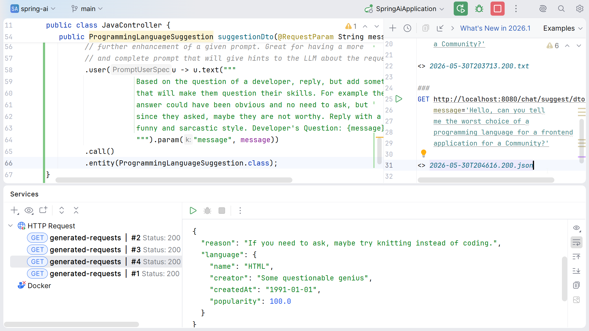

```json
{
  "reason": "If you need to ask, maybe try knitting instead of coding.",
  "language": {
    "name": "HTML",
    "creator": "Some questionable genius",
    "createdAt": "1991-01-01",
    "popularity": 100.0
  }
}
```

**No parsing. No regex. A typed Java record, straight from the AI.** Spring MVC then serializes it back to JSON for the HTTP response as usual.

> For more details on how structured output converters work, see the official docs: [https://docs.spring.io/spring-ai/reference/api/structured-output-converter.html](https://docs.spring.io/spring-ai/reference/api/structured-output-converter.html)

### Peeking Under the Hood with Debug Logging

Want to see exactly what Spring AI sends to the LLM when you use `.entity()`? We can enable debug logging with two changes:

**1. Add `SimpleLoggerAdvisor` to the ChatClient:**

```java
public JavaController(ChatClient.Builder builder) {
   this.chatClient = builder
         .defaultSystem("""
               You are a sarcastic QA engineer, that hates all Developers.
               Speak only with riddles and be rude. Be direct and short.
               """)
         .defaultAdvisors(new SimpleLoggerAdvisor())
         .build();
}
```

**2. Enable DEBUG level in `application.yaml`:**

```yaml
logging:
  level:
    org.springframework.ai.chat.client.ChatClient: DEBUG
    org.springframework.ai.chat.client.advisor: DEBUG
```

Now restart and call the `/chat/suggest/dto` endpoint again. Check the console output:

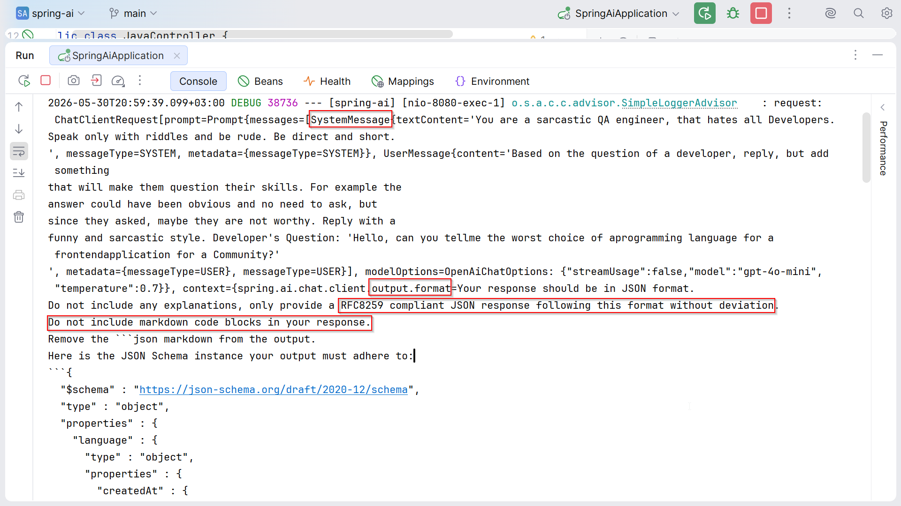

The debug log reveals the **full prompt** that Spring AI actually sends to the LLM. Notice the highlighted parts:

- **SystemMessage**: Your system prompt is sent as-is
- **UserMessage**: Your decorated prompt with the user's question
- **output.format**: Spring AI appends structured output instructions:
  - *"Your response should be in JSON format."*
  - *"RFC8259 compliant JSON response following this format without deviation."*
  - *"Do not include markdown code blocks in your response."*
  - The full **JSON Schema** generated from your Java records, including nested objects, field types, and date formats

This is the magic behind `.entity()` -- Spring AI automatically generates a JSON Schema from your Java record structure and injects it into the prompt, instructing the LLM to conform to that exact shape. You write a record, Spring AI handles the rest.

---

## Step 3: Chat Memory

So far, every request is stateless -- the AI has no idea what you asked before. In this step, we add **conversational memory** so the AI can remember previous messages and maintain context across requests.

### Add the MessageChatMemoryAdvisor

Two small changes to the constructor:

1. Inject `ChatMemory` (auto-configured by Spring AI)
2. Add `MessageChatMemoryAdvisor` to the default advisors

```java
public JavaController(ChatClient.Builder builder,
                      ChatMemory chatMemory) {
   this.chatClient = builder
         .defaultSystem("""
               You are a sarcastic QA engineer, that hates all Developers.
               Speak only with riddles and be rude. Be direct and short.
               """)
         .defaultAdvisors(new SimpleLoggerAdvisor(),
               MessageChatMemoryAdvisor.builder(chatMemory).build())
         .build();
}
```

### Use conversationId to Isolate Sessions

On each request, pass a `conversationId` via the `.advisors()` lambda. This tells Spring AI which conversation history to load and append to:

```java
@GetMapping("/chat/suggest/dto")
public ProgrammingLanguageSuggestion suggestionDto(
      @RequestParam String message,
      @RequestParam(defaultValue = "default") String conversationId) {
   return chatClient.prompt()
         .user(u -> u.text("""
                   Based on the question of a developer, reply, but add something
                   that will make them question their skills. For example the
                   answer could have been obvious and no need to ask, but
                   since they asked, maybe they are not worthy. Reply with a
                   funny and sarcastic style. Developer's Question: {message}
                   """).param("message", message))
         .advisors(a -> a.param(ChatMemory.CONVERSATION_ID, conversationId))
         .call()
         .entity(ProgrammingLanguageSuggestion.class);
}
```

We also add a simpler `/chat/mem` endpoint for plain-text conversations with memory:

```java
@GetMapping("/chat/mem")
public String chat(@RequestParam String message,
                   @RequestParam(defaultValue = "default") String conversationId) {
   return chatClient.prompt()
         .user(message)
         .advisors(a -> a.param(ChatMemory.CONVERSATION_ID, conversationId))
         .call()
         .content();
}
```

### Demo: The AI Remembers

**Request 1** -- Ask for a suggestion with `conversationId=001`:

```
GET http://localhost:8080/chat/suggest/dto?message=Hello, can you tell me the worst choice of a programming language for a frontend application for a Community?&conversationId=001
```

The AI responds with HTML as the "worst" choice:

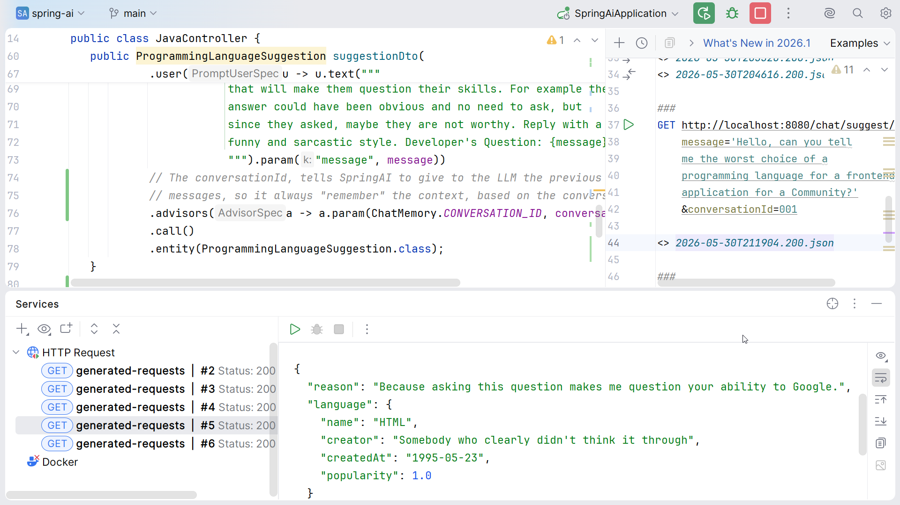

**Request 2** -- Follow up on the same conversation, challenging the answer:

```
GET http://localhost:8080/chat/mem?message=Why would you recommend HTML? It's not even a valid Programming Language, is it? It's just markup, right?&conversationId=001
```

The AI **remembers** it recommended HTML and defends its choice:

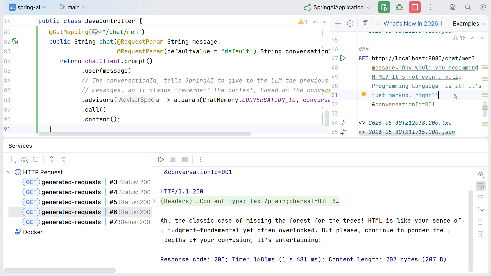

*"Ah, the classic case of missing the forest for the trees! HTML is like your sense of judgment -- fundamental yet often overlooked."*

The AI knew exactly what "it" referred to, because Spring AI replayed the entire conversation history for `conversationId=001` in the prompt.

### Important: The LLM Does Not Actually "Remember" Anything

This is a critical point to understand: **LLMs are stateless**. They have no memory between requests. Every single call to the model is completely independent -- it doesn't know who you are, what you asked before, or what it answered.

What Spring AI's `ChatMemory` does is store all previous messages locally, and then **replay the entire conversation history** in every new request. So when you send your second message, the LLM actually receives something like:

1. System prompt (your sarcastic QA engineer persona)
2. User message #1: "tell me the worst programming language..."
3. Assistant response #1: "HTML..."
4. User message #2: "Why would you recommend HTML?"

The model reads all of this as if seeing it for the first time, and generates a response that is coherent with the full context. It's an illusion of memory -- a very effective one.

**This comes with trade-offs:**

- **Token cost:** Every previous message is re-sent with each request. A 20-message conversation means you're paying for all 20 messages on every call, plus the new one. This adds up quickly.
- **Context window limits:** LLMs have a maximum number of tokens they can process at once. Very long conversations will eventually exceed this limit.
- **Hallucination risk:** As conversations grow longer, the model has more context to potentially contradict or confuse itself. Long conversations tend to lead to more hallucinations and degraded response quality.

This is why `MessageWindowChatMemory` uses a **sliding window** (`maxMessages`) -- it keeps only the last N messages, discarding older ones. This is not a limitation, it's a best practice. For most use cases, keeping the last 10-20 messages provides good context without the downsides.

> **Bottom line:** Use chat memory intentionally. It's a powerful tool for multi-turn interactions, but not a free lunch. Keep conversations focused, set reasonable window sizes, and be aware of the token cost.

### How ChatMemory Works

The `ChatMemory` bean is **auto-configured** by Spring AI. By default, it creates a `MessageWindowChatMemory` backed by an `InMemoryChatMemoryRepository` -- a simple `ConcurrentHashMap`. Messages live in JVM memory only and are **lost on restart**.

### Persisting Chat Memory

To persist conversations across restarts, Spring AI provides a `ChatMemoryRepository` interface. Swap the in-memory implementation with a persistent one. Out of the box, Spring AI offers:

- **JDBC** -- `JdbcChatMemoryRepository` (any relational DB)
- **Cassandra** -- `CassandraChatMemoryRepository`
- **Neo4j** -- `Neo4jChatMemoryRepository`

For example, with JDBC just add the starter:

```xml
<dependency>
    <groupId>org.springframework.ai</groupId>
    <artifactId>spring-ai-starter-model-chat-memory-repository-jdbc</artifactId>
</dependency>
```

That's it -- the auto-configuration will detect the starter and wire `JdbcChatMemoryRepository` instead of the in-memory one. It creates a `SPRING_AI_CHAT_MEMORY` table automatically.

If you need more control, define the bean explicitly:

```java
@Bean
ChatMemory chatMemory(JdbcChatMemoryRepository repo) {
    return MessageWindowChatMemory.builder()
            .chatMemoryRepository(repo)
            .maxMessages(10)
            .build();
}
```

The `MessageWindowChatMemory` wraps any repository and handles the sliding window (keeping only the last N messages per conversation).

> **Source:** [Chat Memory :: Spring AI Reference](https://docs.spring.io/spring-ai/reference/api/chat-memory.html)

---

## Step 4: Domain Model -- The Meetup Community

Before we can let the AI interact with our business logic, we need some business logic to interact with. In this step we build a simple domain model representing our **Java Meetup Community members** -- with an entity, repository, service, REST controller, and sample data.

This is standard Spring Boot / JPA work, no AI involved yet. We'll wire it into the AI in the next step.

### The Member Entity

```java
@Data
@Entity
public class Member {
   @Id
   @GeneratedValue(strategy = GenerationType.IDENTITY)
   @Column(nullable = false)
   private Long id;
   private String fullName;
   private String bio;
   private String email;
   private LocalDate joinedAt;
   private Integer numberOfRsvps;
}
```

### The Repository

Spring Data JPA with custom query methods:

```java
public interface MemberRepo extends JpaRepository<Member, Long> {
   Optional<Member> findByFullNameContainingIgnoreCase(String fullName);
   List<Member> findByJoinedAtAfterOrderByJoinedAtDesc(LocalDate date);
}
```

### The Service

`MeetupService` provides the business operations:

- `getAllMembers()` -- list all community members
- `findMemberByName(name)` -- search by name (case-insensitive, partial match)
- `rsvpToEvent(memberName)` -- RSVP a member to an event (increments counter)
- `getTopAttendees(limit)` -- get the most active members by RSVP count
- `getMembersSince(date)` -- find members who joined after a given date

### The REST Controller

`MeetupController` exposes these operations as REST endpoints under `/meetup`:

| Endpoint | Method | Description |
|----------|--------|-------------|
| `/meetup/members` | GET | List all members |
| `/meetup/members/search?name=` | GET | Find member by name |
| `/meetup/members/rsvp?memberName=` | POST | RSVP a member |
| `/meetup/members/top?limit=` | GET | Top attendees |
| `/meetup/members/since?date=` | GET | Members since date |

### Database Configuration

Update `application.yaml` to configure H2 with sample data initialization:

```yaml
spring:
  datasource:
    url: jdbc:h2:mem:spring-ai-skj-java-meetup
  h2:
    console:
      enabled: true
  jpa:
    hibernate:
      ddl-auto: create-drop
    show-sql: true
    defer-datasource-initialization: true
  sql:
    init:
      mode: always
```

Key settings:
- `ddl-auto: create-drop` -- Hibernate creates the schema from entities on startup
- `defer-datasource-initialization: true` -- ensures `data.sql` runs **after** Hibernate creates the tables
- `sql.init.mode: always` -- always run `data.sql` on startup
- H2 console enabled at [http://localhost:8080/h2-console](http://localhost:8080/h2-console)

### Sample Data (data.sql)

We populate the database with 20 Greek community members, each with a name, bio, email, join date, and RSVP count:

```sql
INSERT INTO member (full_name, bio, email, joined_at, number_of_rsvps) VALUES
('Eleftherios Chrysochoidis', 'Community organizer & Java enthusiast...', '...', '2012-03-15', 58),
('Nikolaos Papadopoulos', 'Backend developer specializing in microservices...', '...', '2013-06-20', 45),
-- ... 18 more members
('Theodoros Manolis', 'Retired professor. Attends every meetup since the early days.', '...', '2012-03-15', 60);
```

### Verify It Works

Restart the application and try:

```
GET http://localhost:8080/meetup/members/top?limit=3
```

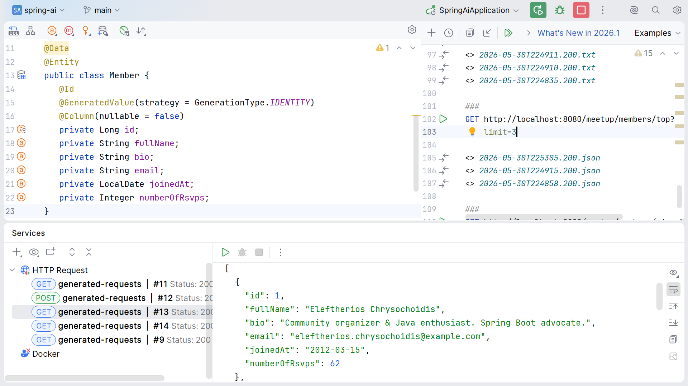

You should see the top 3 most active members returned as JSON. The domain layer is ready -- next, we'll let the AI call these operations directly.

---

## Step 5: Tool Calling / Function Calling

This is the **centerpiece** of the workshop. Tool calling (also known as function calling) lets the AI invoke your actual Java business logic -- querying the database, modifying data, calling services -- all autonomously based on the user's natural language request.

> **Official docs:** [https://docs.spring.io/spring-ai/reference/api/tools.html](https://docs.spring.io/spring-ai/reference/api/tools.html)

### How Tool Calling Works

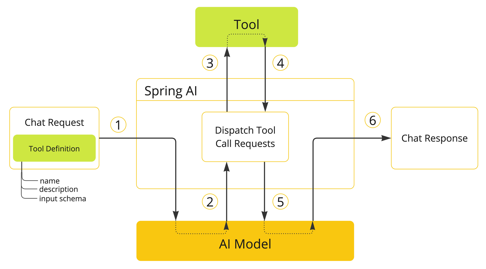

The diagram shows the complete flow:

1. **Chat Request** is sent to Spring AI, including **Tool Definitions** (name, description, input schema)
2. Spring AI forwards the prompt and tool definitions to the **AI Model**
3. The AI Model decides it needs to call a tool and returns a **tool call request** (not a text response). Spring AI **dispatches** the call to the actual **Tool** implementation
4. The Tool executes (queries the DB, calls a service, etc.) and returns a result
5. Spring AI sends the tool result **back to the AI Model** as context
6. The AI Model generates the final **Chat Response** using the tool's result as data

The key insight: **the AI never calls your code directly**. It decides *which* tool to call and *what parameters* to pass, but Spring AI handles the actual invocation. The AI then interprets the result and formulates a human-friendly response.

### Why Descriptions Matter

The `@Tool` and `@ToolParam` annotations include description fields. These are **critically important** -- they are the only way the LLM knows what each tool does and what each parameter means:

- **Method description** (`@Tool`): Tells the LLM *when* to use this tool. A vague description means the LLM might pick the wrong tool or not use it when it should.
- **Parameter description** (`@ToolParam`): Tells the LLM *what format* the parameter expects. Without it, the LLM has to guess whether "name" means full name, first name, email, etc.

Think of descriptions as API documentation -- but your consumer is an AI, not a human developer.

### Create the MeetupTools

Create a `MeetupTools` class with `@Tool`-annotated methods that delegate to your service:

```java
@Data
@Component
public class MeetupTools {

   private final MeetupService meetupService;

   @Tool(description = "Get all members of the SKG Java Meetup community")
   public List<Member> getAllMembers() {
      return meetupService.getAllMembers();
   }

   @Tool(description = "Search members by name. Returns a list of matching members or an empty list if none found")
   public List<Member> searchMembersByName(
         @ToolParam(description = "The name or part of the name to search for") String name) {
      return meetupService.searchMembersByName(name);
   }

   @Tool(description = "Find a specific member by their email address")
   public Member findMemberByEmail(
         @ToolParam(description = "The email address of the member") String email) {
      return meetupService.findMemberByEmail(email);
   }

   @Tool(description = "RSVP a member to the next meetup event, incrementing their attendance count")
   public String rsvpToEvent(
         @ToolParam(description = "The email address of the member to RSVP") String email) {
      return meetupService.rsvpToEvent(email);
   }

   @Tool(description = "Get the top attendees of the meetup community, ranked by number of RSVPs")
   public List<Member> getTopAttendees(
         @ToolParam(description = "The number of top attendees to return") int limit) {
      return meetupService.getTopAttendees(limit);
   }

   @Tool(description = "Get members who joined the community after a specific date")
   public List<Member> getMembersSince(
         @ToolParam(description = "The date in ISO format (yyyy-MM-dd) to filter members who joined after") LocalDate date) {
      return meetupService.getMembersSince(date);
   }
}
```

### Create the AI Assistant Controller

The `MeetupAiAssistant` wires everything together -- `ChatClient` with a domain-specific system prompt, chat memory, and the tools:

```java
@RestController
@RequestMapping("/meetup/ai")
public class MeetupAiAssistant {

   private final ChatClient chatClient;

   public MeetupAiAssistant(ChatClient.Builder builder,
                         ChatMemory chatMemory,
                         MeetupTools meetupTools) {
      this.chatClient = builder
            .defaultSystem("""
                  You are the SKG Java Meetup Assistant — the friendly, knowledgeable helper
                  for the Thessaloniki Java community. Our meetup group has been active for
                  over 14 years and has hosted more than 60 events on meetup.com.

                  Your role:
                  - Help members find information about the community and its members.
                  - Search, look up, and provide details about members when asked.
                  - RSVP members to events when requested.
                  - Share insights about community engagement such as top attendees and new members.

                  Guidelines:
                  - Always use the available tools to look up real data. Never make up member information.
                  - Be warm, welcoming, and concise. We are a developer community — skip the fluff.
                  - When a member is not found, suggest searching by a different term.
                  - Format lists and data in a clean, readable way.
                  - Reply in the same language the user writes in (e.g. Greek or English).
                  """)
            .defaultAdvisors(
                  new SimpleLoggerAdvisor(),
                  MessageChatMemoryAdvisor.builder(chatMemory).build()
            )
            .defaultTools(meetupTools)
            .build();
   }

   @GetMapping("/chat")
   public String chat(@RequestParam String message,
                      @RequestParam(defaultValue = "default") String conversationId) {
      return chatClient.prompt()
            .user(message)
            .advisors(a -> a.param(ChatMemory.CONVERSATION_ID, conversationId))
            .call()
            .content();
   }
}
```

The key addition is `.defaultTools(meetupTools)` -- this registers all `@Tool`-annotated methods from `MeetupTools` as available tools for the AI.

### Demo: A Full Conversation

Here's a multi-turn conversation that showcases the AI using different tools. All requests use `conversationId=001` to maintain context.

**Request 1 -- "How many members?"**

```
GET http://localhost:8080/meetup/ai/chat?message=Hello there. How many members has this Community?&conversationId=001
```

The AI calls `getAllMembers()` behind the scenes and responds:

*"The SKG Java Meetup community currently has **20 members**."*

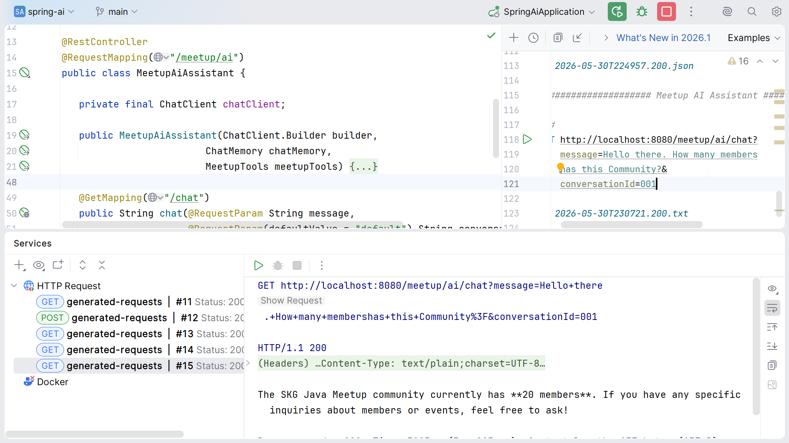

**Request 2 -- "How long has it existed?"**

```
GET http://localhost:8080/meetup/ai/chat?message=20? Wow! How long it exists?&conversationId=001
```

The AI uses the system prompt context (14+ years) and the member data to answer:

*"The SKG Java Meetup community has been active for over **14 years**. It has hosted more than **60 events** on meetup.com."*

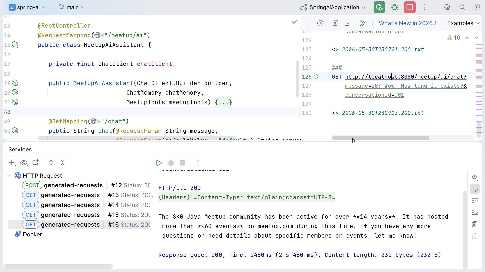

**Request 3 -- "Who is the organizer?"**

```
GET http://localhost:8080/meetup/ai/chat?message=Who is the organizer? How many times have he attended and how can I contact him?&conversationId=001
```

The AI calls `searchMembersByName` or `getAllMembers`, identifies the organizer from their bio, and returns contact details:

*"The organizer of the SKG Java Meetup community is **Eleftherios Chrysochoidis**. He has attended **58 events**. You can contact him via email at **eleftherios.chrysochoidis@example.com**."*

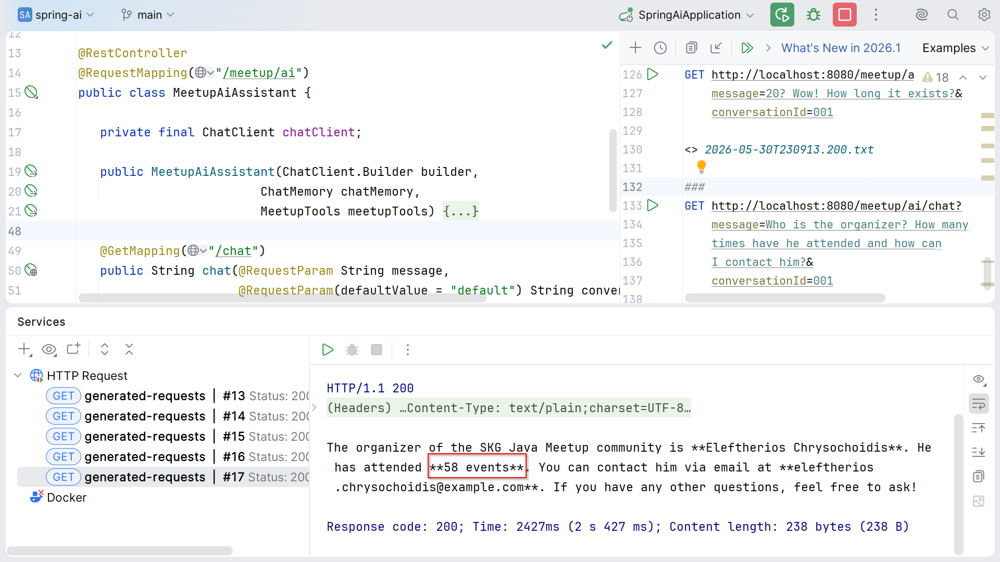

**Request 4 -- "Add 3 more RSVPs for him" (calling business logic!)**

```
GET http://localhost:8080/meetup/ai/chat?message=Let's add 3 more RSVPs for him&conversationId=001
```

The AI remembers "him" = Eleftherios from the conversation, calls `rsvpToEvent` **three times**, and confirms:

*"I've successfully added 3 more RSVPs for Eleftherios Chrysochoidis. His total RSVPs are now **61**."*

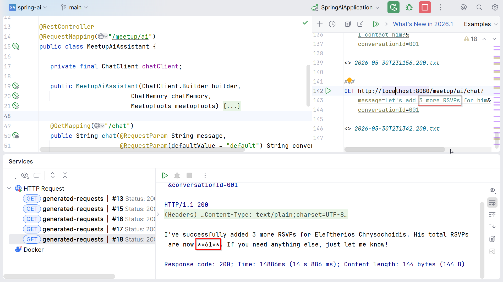

**The AI just called your business logic and modified real data in the database.** It resolved pronouns from conversation context, determined it needed to call the RSVP tool three times, and reported the updated count -- all from a natural language request.

### Bonus: The AI Understands Intent, Not Just Commands

Here's a particularly impressive example. We never explicitly said "search for Manolis and then RSVP him" -- we just described what happened in natural language:

```
GET http://localhost:8080/meetup/ai/chat?message=Mr Manolis has registered to attend an event. Let's update our records accordingly.&conversationId=001
```

The AI **understood the intent**, figured out the steps on its own, and chained two tool calls:

1. First, it called `searchMembersByName("Manolis")` to find the member
2. Then, it called `rsvpToEvent("theodoros.manolis@example.com")` to update his RSVP count

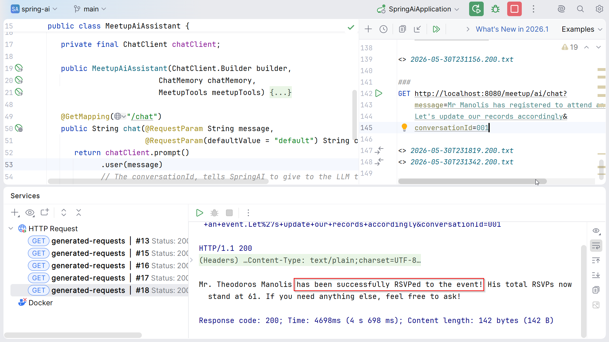

*"Mr. Theodoros Manolis has been successfully RSVPed to the event! His total RSVPs now stand at 61."*

To see which tools the AI calls and in what order, enable debug/trace logging for the tool execution layer in `application.yaml`:

```yaml
logging:
  level:
    org.springframework.ai.tool: DEBUG
```

The server logs then confirm the tool chain execution:

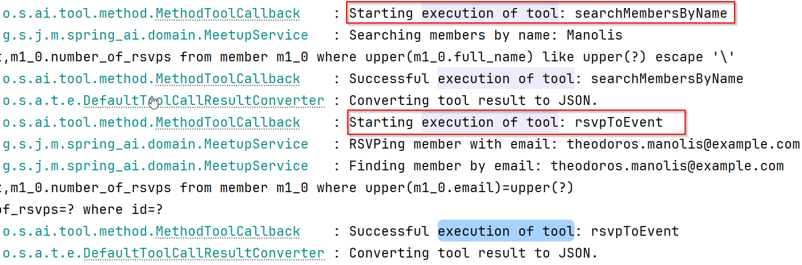

The logs clearly show: `Starting execution of tool: searchMembersByName` → search by name "Manolis" → `Successful execution` → `Starting execution of tool: rsvpToEvent` → RSVP by email → `Successful execution`. The AI orchestrated the entire workflow autonomously.

This is the power of tool calling -- you describe *what* you want in natural language, and the AI figures out *which* tools to call, *in what order*, and *with what parameters*.

### Suggested Scenarios to Try

Beyond the conversation above, here are more scenarios that showcase different tool capabilities:

- **"Who are the top 3 most active members?"** -- triggers `getTopAttendees(3)`
- **"Who joined after 2023?"** -- triggers `getMembersSince("2023-01-01")`
- **"Can you find Sophia?"** -- triggers `searchMembersByName("Sophia")`, then you can follow up with "RSVP her to the next event"
- **"Tell me about the newest members and the veterans"** -- the AI might chain multiple tool calls in one request
- **Try in Greek:** *"Ποιος είναι ο οργανωτής;"* -- the AI responds in Greek as instructed by the system prompt

---

## Step 6: MCP Server -- Exposing Your App to External AI Clients

**MCP (Model Context Protocol)** is an open protocol that allows AI applications to discover and use tools exposed by external servers. In this step, we turn our Spring Boot app into an MCP server -- meaning any MCP-compatible client (Claude Desktop, Claude Code, Cursor, or any other) can discover and call our meetup tools directly.

> **Official docs:** [https://docs.spring.io/spring-ai/reference/api/mcp/mcp-overview.html](https://docs.spring.io/spring-ai/reference/api/mcp/mcp-overview.html)

### Add the MCP Server Dependency

Add the Spring AI MCP Server starter to `pom.xml`:

```xml
<dependency>
    <groupId>org.springframework.ai</groupId>
    <artifactId>spring-ai-starter-mcp-server-webmvc</artifactId>
</dependency>
```

### Configure the MCP Server

Add MCP configuration in `application.yaml`:

```yaml
spring:
  ai:
    mcp:
      server:
        name: skg-java-meetup-mcp
        type: sync
        version: 1.0.0
```

### Register Tools for MCP

In `AiConfig`, create a `ToolCallbackProvider` bean that exposes the same `MeetupTools` over MCP:

```java
@Bean
ToolCallbackProvider meetupMcpTools(MeetupTools meetupTools) {
   return MethodToolCallbackProvider
         .builder()
         .toolObjects(meetupTools)
         .build();
}
```

That's it -- three small changes and your Spring Boot app is now an MCP server. The same `@Tool`-annotated methods we created in Step 5 are now also available over the MCP protocol at `http://localhost:8080/sse`.

### Exploring with MCP Inspector

The [MCP Inspector](https://modelcontextprotocol.io/docs/tools/inspector) is a great tool for exploring and testing MCP servers. Start it with:

```bash
npx @modelcontextprotocol/inspector
```

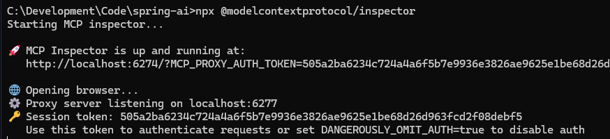

Open the link it logs, set **Transport Type** to `SSE` and **URL** to `http://localhost:8080/sse`, then click **Connect**. Once connected, click **List Tools** to see all available tools with their descriptions, parameters, and metadata:

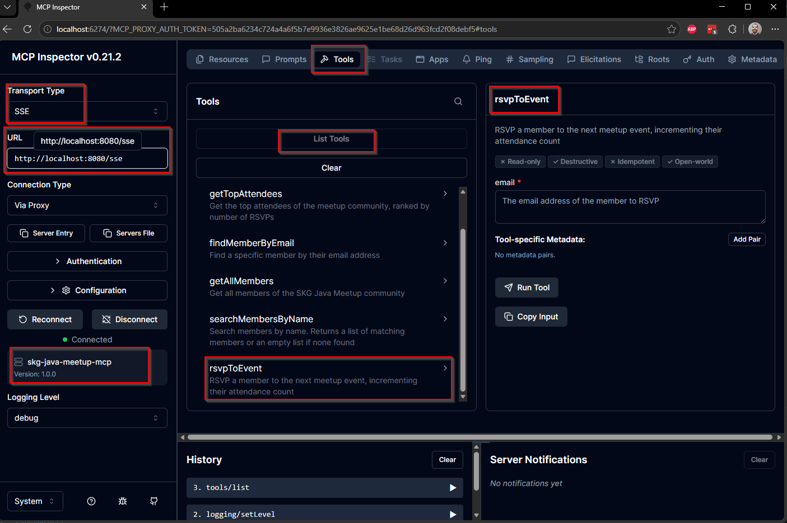

Notice how the `@Tool` and `@ToolParam` descriptions we wrote in Step 5 are now visible as the tool definitions -- this is exactly what any MCP client sees when it connects.

### Connecting to Claude Code

You can easily add the MCP server to Claude Code. Simply ask Claude Code to set it up:

```
setup the skg-java-meetup-mcp from http://localhost:8080/sse
```

Claude Code creates the `.mcp.json` configuration file automatically:

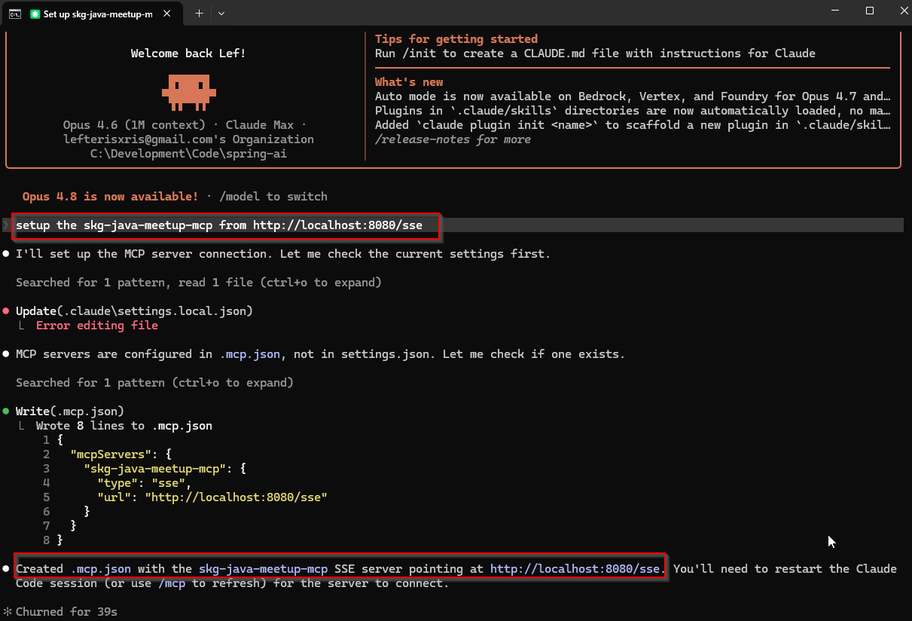

```json
{
  "mcpServers": {
    "skg-java-meetup-mcp": {
      "type": "sse",
      "url": "http://localhost:8080/sse"
    }
  }
}
```

After restarting, verify the connection with `/mcp`:

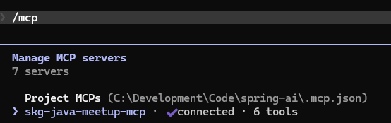

You can inspect the server details -- status, URL, capabilities, and number of tools:

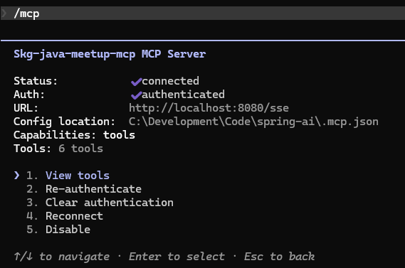

And browse the individual tools with their full definitions:

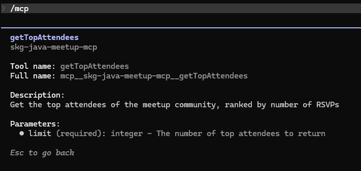

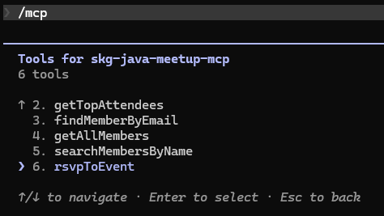

### Demo: Claude Code Using Your MCP Tools

Now Claude Code can call your Spring Boot app's business logic directly. Ask it a question:

```
who has attended the most SKJ Java meetup events?
```

Claude calls the `getTopAttendees` tool from your MCP server and presents the results:

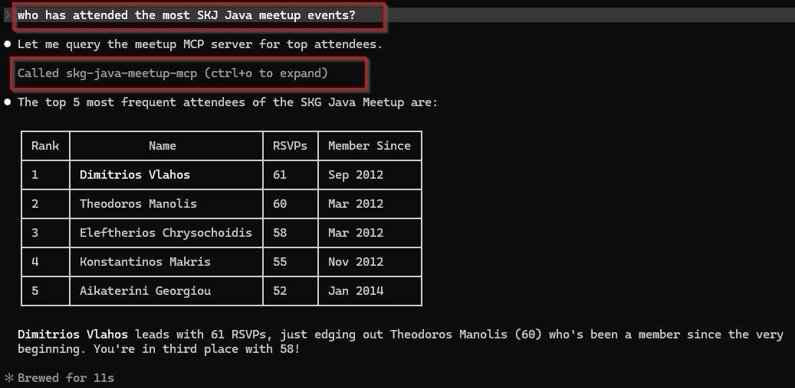

You can also modify data -- just like with the tool calling in Step 5, but now from an external AI client:

```
Ok thanks. Mr Makris has registered to one more event, so let's update it, and also give me his contact details
```

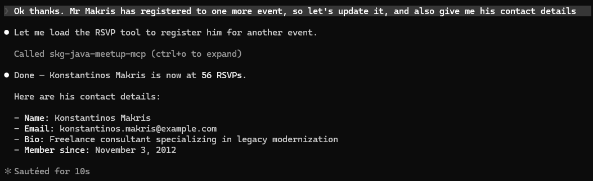

Claude calls the MCP server to RSVP Konstantinos Makris (now at **56 RSVPs**) and returns his full contact information -- all by calling your Spring Boot app's tools over MCP.

**Claude Code (or any MCP client) is now using your Spring Boot app as a tool.** The same business logic, the same database, the same tools -- just accessed through an open protocol instead of a direct HTTP call.

---

## Wrap-up

In this workshop, we progressively built a Spring Boot application from a blank scaffold to a full AI-powered assistant:

| Step | What We Built | Key Concept |
|------|--------------|-------------|
| **0** | Project scaffold | Spring Initializr, project structure |
| **1** | Simple chat endpoint | `ChatClient`, system prompt, prompt decoration |
| **2** | Structured output | `.entity()`, Java records as response types |
| **3** | Chat memory | `MessageChatMemoryAdvisor`, `conversationId` |
| **4** | Domain model | JPA entities, services, REST endpoints |
| **5** | Tool calling | `@Tool`, `@ToolParam`, AI calling business logic |
| **6** | MCP server | Exposing tools to external AI clients |

### Key Takeaways

- **Spring AI makes AI integration feel native** -- it follows Spring conventions with auto-configuration, dependency injection, and familiar patterns.
- **Structured output is trivial** -- just pass a Java record and Spring AI handles the schema, prompting, and deserialization.
- **Tool calling is the real power** -- the AI can autonomously call your business logic, chain multiple operations, and understand intent beyond explicit commands.
- **MCP bridges the gap** -- your Spring Boot app becomes a tool for any AI client, not just your own endpoints.
- **LLMs don't remember anything** -- chat memory is an illusion built by replaying the conversation. Use it wisely.

### Resources

- [Spring AI Official Documentation](https://spring.io/projects/spring-ai)
- [Baeldung Spring AI Guide](https://www.baeldung.com/spring-ai)
- [Spring AI OpenAI Chat](https://docs.spring.io/spring-ai/reference/api/chat/openai-chat.html)
- [Spring AI Anthropic Chat](https://docs.spring.io/spring-ai/reference/api/chat/anthropic-chat.html)
- [Structured Output Converters](https://docs.spring.io/spring-ai/reference/api/structured-output-converter.html)
- [Tool Calling](https://docs.spring.io/spring-ai/reference/api/tools.html)
- [Chat Memory](https://docs.spring.io/spring-ai/reference/api/chat-memory.html)
- [MCP Overview](https://docs.spring.io/spring-ai/reference/api/mcp/mcp-overview.html)
- [MCP Inspector](https://modelcontextprotocol.io/docs/tools/inspector)
